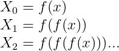
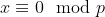
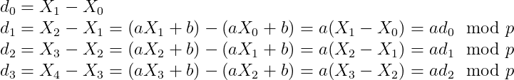
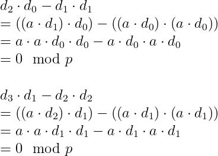
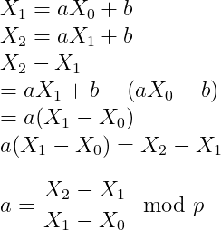
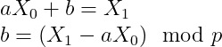

# Randomness (Crypto)
```
XOR is simple , but if I choose random things, would it be more secure?

Author: Semah BA
```
Challenge file: [Randomness.py](Randomness.py)
```py
from Crypto.Util.number import *
from random import *

flag="TODO"
p=getPrime(64)
a=getrandbits(64)
b=getrandbits(64)
X=[]
X.append((a*getrandbits(64)+b)%p)
c=0
while c<len(flag):
	X.append((a*X[c]+b)%p)
	c+=1

output=[]

for i in range(len(flag)):
	output.append(ord(flag[i])^X[i])

print (output)
#output:[6680465291011788243L, 5100570103593250421L,...
```
Given a python file, it encrypts the flag by **XORing with X[i]** 

We are given with the output, even though XOR can be reversed but we do not know the `X[i]` value so cannot reverse **unless we know the original `X` array** then we can reverse the flag.

After analysing the code, it got a starting random 64bit value `x` and loop to the same function again and again:


And then `p` is a prime, `a` and `b` is a random number, we do not know all of the unknowns

## Researching
This reminds me of a challenge in Google CTF, the **Chunk Norris** because it also generate numbers using the same function

I went to a [writeup by Joseph Surin](https://www.josephsurin.me/posts/2020-08-24-googlectf-2020-writeups) in CTFtime

It mention a term I did not heard before: **LCG**, then I go research about it

The full name is called [*Linear congruential generator*](http://en.wikipedia.org/wiki/Linear_congruential_generator), and is the algorithm that this challenge used:
\modp)

After some research, I found an [awesome website](https://tailcall.net/blog/cracking-randomness-lcgs/) that explain how to crack the LCG!!

## Cracking
First of all, we need to calculate `p` first

We know that when  (when x divide p remainder is 0)

Then it means `x = kp`

For example, 6/3 = 2 remainder 0, x = 6, k = 2, p = 3 

If we find two values like this, we can calculate the GCD (Greatest Common Divisor) and get the `p`

So we need to calculate two number that remainder when divide p is 0

We can do some substration and multiplication on the output

Assume differences of `X`s is `d`:



Then we can do some trick to get 0 mod p:



Before the calculation we need to XOR the `X` array to original `X` first

We know the flag starts with `FwordCTF{`, so just XOR it with the output array to get the original `X` value:
```py
output = [6680465291011788243L, 5100570103593250421L, ...]
flag = "FwordCTF{"
X = []
for o,f in zip(output,flag):
	X.append(o^ord(f))
```
Then apply the calculation above:
```py
d = []
for i in range(4):
	d.append(X[i+1] - X[i])
ans1 = d[2]*d[0] - d[1]*d[1]
ans2 = d[3]*d[1] - d[2]*d[2]
# GCD of both value is p
print gcd(ans1,ans2)
```
Result:
```
9444729917070668893
```
Yay! We found to value p!!

Next step is to find find value a, we also can calculate it:



In modular arithmetic, we cannot directly divide values

So we need to calculate the modular multiplicative inverse of it using python:
```py
a = (X[2]-X[1])* inverse(X[1]-X[0],p) % p
print a
# 7762244320486225184
```
Lastly, finding value b is easy:



Substitute the values in to calculate:
```py
b = X[1]-a*X[0] % p
# 731234830430177597
```
Now we have all values we need to generate the original `X` array

That means we can generate and decrypt the ciphertext by just XOR it!!
```py
# Original first X
X=[6680465291011788181]
c=0
# Generate original X
while c<len(output):
	X.append((a*X[c]+b)%p)
	c+=1
flag = ''
# XORing with the output the get the flag
for a,b in zip(output,X):
	flag += chr(a^b)
print flag
```
That it!! Lots of maths involving, quite interesting challenge

[Full python script](solve.py)
## Flag
```
FwordCTF{LCG_easy_to_break!That_was_a_mistake_choosing_it_as_a_secure_way}
```