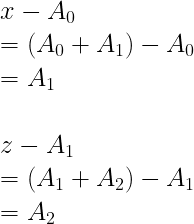

# Secret Array (Misc)
```
nc secretarray.fword.wtf 1337

Author: KOOLI
```
Netcat in, it outputs:
```
I have a 1337 long array of secret positive integers. The only information I can provide is the sum of two elements. You can ask for that sum up to 1337 times by specifing two different indices in the array.

[!] - Your request should be in this format : "i j". In this case, I'll respond by arr[i]+arr[j]

[!] - Once you figure out my secret array, you should send a request in this format: "DONE arr[0] arr[1] ... arr[1336]"

[*] - Note 1: If you guessed my array before 1337 requests, you can directly send your DONE request.
[*] - Note 2: The DONE request doesn't count in the 1337 requests you are permitted to do.
[*] - Note 3: Once you submit a DONE request, the program will verify your array, give you the flag if it's a correct guess, then automatically exit.

START:
```
Basically we can request addition of two different numbers, and need to answer all 1337 numbers.

This can easily solve by maths:


Once we get the first number `A0` then we can calculate the second and third one:



Once we found all, we can continue to calculate the rest by requesting `0 3`, `0 4` etc and substracting with the first number, until 1337

I solve this using Python and Pwntools:
```py
from pwn import *
a = []
p = remote("secretarray.fword.wtf", 1337)
p.recvuntil("START:\n")
p.sendline("0 1")
x = int(p.recvuntil("\n")[:-1])
p.sendline("0 2")
y = int(p.recvuntil("\n")[:-1])
p.sendline("1 2")
z = int(p.recvuntil("\n")[:-1])
a.append((x + y - z)//2)
a.append(x - a[0])
a.append(z - a[1])

for i in range(3,1337):
	p.sendline("0 %i"%(i+1))
	a.append(int(p.recvuntil("\n")[:-1])-a)
	print(i)

ans = "DONE"
for i in range(1337):
	ans += " " + str(a[i])
p.sendline(ans)
p.interactive()
```

## Flag
```
FwordCTF{it_s_all_about_the_math}
```